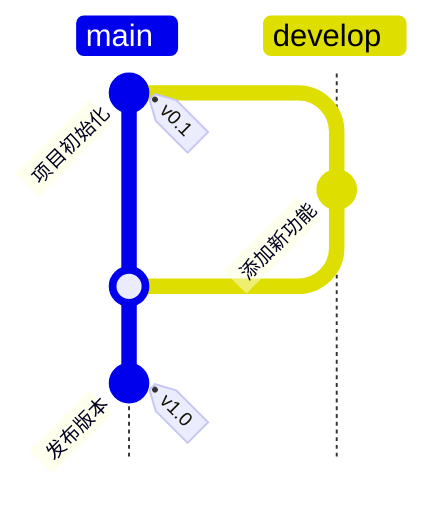

<h1 align="center">

FlowMinder
</h1>

<p align="center">
  <a href="https://FlowMinder.wiki-power.com/"></a>
  <a href="https://github.com/linyuxuanlin/FlowMinder/blob/main/LICENSE"></a>
  
</p>

<p align="center">
        
</p>

FlowMinder是一个基于Git图形可视化理念的项目管理Web应用。它利用Mermaid.js库渲染Git图形，帮助团队直观地可视化项目的分支结构和任务进展，提高项目透明度和协作效率。

## 功能特点

- 使用Mermaid gitgraph从上至下（TB模式）展示项目分支流程图
- 支持多个并行分支的可视化展示与切换
- 响应式设计，完美适配不同设备屏幕
- 实时更新和自动刷新功能
- 支持通过Docker Compose快速部署
- 可自定义项目文件夹路径
- 优雅的UI设计，提供流畅的用户体验
- 支持中文路径和文件名

## 技术栈

- 前端：原生JavaScript、HTML5、CSS3
- 图表渲染：Mermaid.js
- 容器化：Docker & Docker Compose
- 服务器：Nginx

## 项目结构

```
FlowMinder/
├── app/                  # Web应用源码
│   ├── css/              # 样式文件
│   │   └── style.css     # 主样式文件
│   ├── js/               # JavaScript文件
│   │   └── app.js        # 应用逻辑
│   └── index.html        # 主页面
├── example_project/      # 示例项目文件夹（默认项目）
│   ├── main-branch.md    # 主分支流程图
│   ├── feature-test.md   # 测试功能开发分支
│   └── devops-pipeline.md # DevOps流水线分支
├── compose.yml           # Docker Compose配置
├── nginx.conf            # Nginx服务器配置
├── .env                  # 环境变量配置
└── README.md             # 项目说明文档
```

## 快速开始

### 前提条件

- 安装 [Docker](https://www.docker.com/get-started) 和 [Docker Compose](https://docs.docker.com/compose/install/)

### 运行应用

1. 克隆此仓库：

```bash
git clone https://github.com/yourusername/FlowMinder.git
cd FlowMinder
```

2. 启动Docker容器：

```bash
# 使用默认示例项目文件
docker compose up -d

# 或指定自定义项目路径
CUSTOM_PROJECT_PATH=/path/to/your/project docker compose up -d
```

3. 打开浏览器访问应用：

```
http://localhost:8080
```

### 自定义项目路径

你可以通过以下方式设置自定义项目路径：

1. 修改`.env`文件（推荐方式）：

```bash
# 编辑.env文件
echo "CUSTOM_PROJECT_PATH=/path/to/your/project" > .env

# 然后启动容器
docker compose up -d
```

2. 或者使用环境变量直接设置：

```bash
CUSTOM_PROJECT_PATH=/path/to/your/project docker compose up -d
```

## 项目文件格式

### Mermaid Gitgraph格式

每个分支文件应包含有效的Mermaid gitgraph代码。基本格式示例：

```markdown




## 使用指南

### 添加新分支

1. 在项目文件夹中创建新的Markdown文件，如`new-feature.md`
2. 在文件中添加符合Mermaid gitgraph语法的内容
3. 保存文件后，FlowMinder将自动检测并显示新分支

### 修改现有分支

直接编辑对应的Markdown文件，保存后FlowMinder将自动更新显示内容。

## 部署与维护

### 停止应用

```bash
docker compose down
```

## 许可证

MIT 
