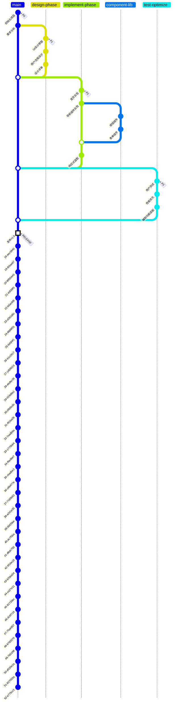

# 分支1：用户界面开发

```mermaid
gitGraph TB:
    commit id: "初始化项目" tag: "P0"
    commit id: "需求分析"
    branch design-phase
    checkout design-phase
    commit id: "UI设计草图" tag: "P1"
    commit id: "用户流程设计"
    commit id: "设计评审"
    checkout main
    merge design-phase
    branch implement-phase
    checkout implement-phase
    commit id: "首页实现" tag: "P2"
    commit id: "导航组件实现"
    branch component-lib
    checkout component-lib
    commit id: "按钮组件"
    commit id: "表单组件"
    checkout implement-phase
    merge component-lib
    commit id: "响应式适配"
    checkout main
    merge implement-phase
    branch test-optimize
    checkout test-optimize
    commit id: "用户测试" tag: "P3" 
    commit id: "性能优化"
    commit id: "辅助功能适配"
    checkout main
    merge test-optimize
    commit id: "发布v1.0" type: HIGHLIGHT tag: "RELEASE"
    commit
    commit
    commit
    commit
    commit
    commit
    commit
    commit
    commit
    commit
    commit
    commit
    commit
    commit
    commit
    commit
    commit
    commit
    commit
    commit
    commit
    commit
    commit
    commit
    commit
    commit
    commit
    commit
    commit
    commit
    commit
    commit
    commit
    commit
    commit
```

## 任务状态

- [x] P0: 项目初始化与需求分析
- [x] P1: 设计阶段完成
- [x] P2: 实现阶段完成
- [x] P3: 测试与优化阶段完成 