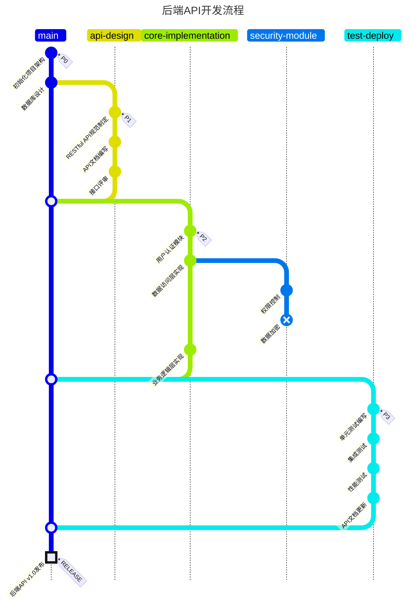

# 分支2：后端API开发

```mermaid
---
title: 后端API开发流程
---
gitGraph TB:
    commit id: "初始化项目架构" tag: "P0"
    commit id: "数据库设计"
    branch api-design
    checkout api-design
    commit id: "RESTful API规范制定" tag: "P1"
    commit id: "API文档编写"
    commit id: "接口评审"
    checkout main
    merge api-design
    branch core-implementation
    checkout core-implementation
    commit id: "用户认证模块" tag: "P2"
    commit id: "数据访问层实现"
    branch security-module
    checkout security-module
    commit id: "权限控制"
    commit id: "数据加密" type: REVERSE
    checkout core-implementation
    commit id: "业务逻辑层实现"
    checkout main
    merge core-implementation
    branch test-deploy
    checkout test-deploy
    commit id: "单元测试编写" tag: "P3"
    commit id: "集成测试"
    commit id: "性能测试"
    commit id: "API文档更新"
    checkout main
    merge test-deploy
    commit id: "后端API v1.0发布" type: HIGHLIGHT tag: "RELEASE"
```

## 任务状态

- [x] P0: 项目架构与数据库设计
- [x] P1: API设计阶段完成
- [x] P2: 核心功能实现（部分安全模块未完成）
- [x] P3: 测试与部署阶段完成 