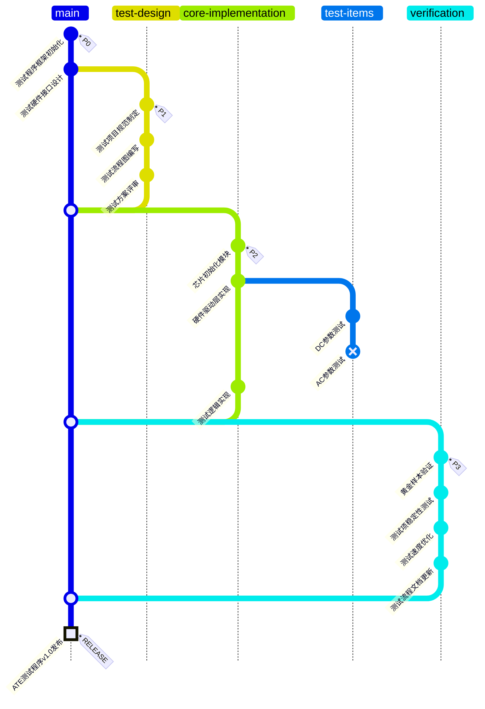

# Branch2

```mermaid
gitGraph TB:
    commit id: "测试程序框架初始化" tag: "P0"
    commit id: "测试硬件接口设计"
    branch test-design
    checkout test-design
    commit id: "测试项目规范制定" tag: "P1"
    commit id: "测试流程图编写"
    commit id: "测试方案评审"
    checkout main
    merge test-design
    branch core-implementation
    checkout core-implementation
    commit id: "芯片初始化模块" tag: "P2"
    commit id: "硬件驱动层实现"
    branch test-items
    checkout test-items
    commit id: "DC参数测试"
    commit id: "AC参数测试" type: REVERSE
    checkout core-implementation
    commit id: "测试逻辑实现"
    checkout main
    merge core-implementation
    branch verification
    checkout verification
    commit id: "黄金样本验证" tag: "P3"
    commit id: "测试项稳定性测试"
    commit id: "测试速度优化"
    commit id: "测试流程文档更新"
    checkout main
    merge verification
    commit id: "ATE测试程序v1.0发布" type: HIGHLIGHT tag: "RELEASE"
```

## 任务状态

- [x] P0: 测试程序架构与硬件接口设计
- [x] P1: 测试规范与流程设计完成
- [x] P2: 核心功能实现（部分AC参数测试未完成）
- [x] P3: 验证与优化阶段完成 