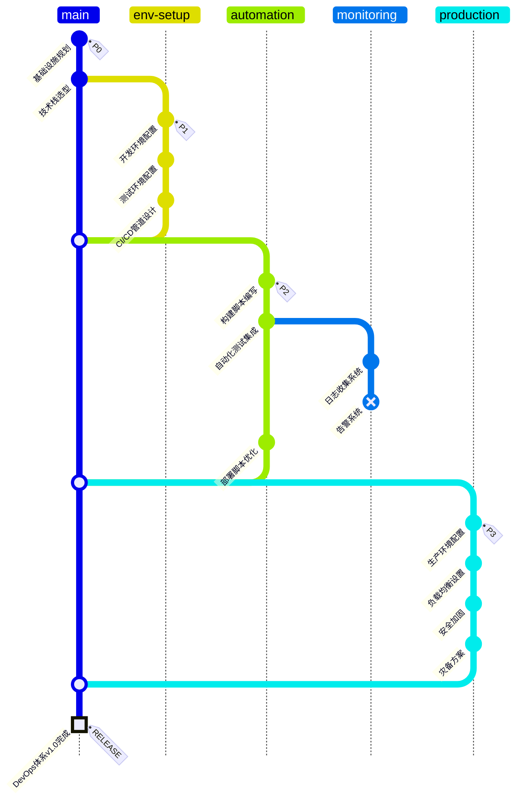

# 分支3：部署与DevOps

```mermaid
gitGraph TB:
    commit id: "基础设施规划" tag: "P0"
    commit id: "技术栈选型"
    branch env-setup
    checkout env-setup
    commit id: "开发环境配置" tag: "P1"
    commit id: "测试环境配置"
    commit id: "CI/CD管道设计"
    checkout main
    merge env-setup
    branch automation
    checkout automation
    commit id: "构建脚本编写" tag: "P2"
    commit id: "自动化测试集成"
    branch monitoring
    checkout monitoring
    commit id: "日志收集系统"
    commit id: "告警系统" type: REVERSE
    checkout automation
    commit id: "部署脚本优化"
    checkout main
    merge automation
    branch production
    checkout production
    commit id: "生产环境配置" tag: "P3"
    commit id: "负载均衡设置"
    commit id: "安全加固"
    commit id: "灾备方案"
    checkout main
    merge production
    commit id: "DevOps体系v1.0完成" type: HIGHLIGHT tag: "RELEASE"
```

## 任务状态

- [x] P0: 基础设施规划与技术选型
- [x] P1: 环境搭建阶段完成
- [x] P2: 自动化流程实现（监控告警系统未完成）
- [x] P3: 生产环境配置完成 