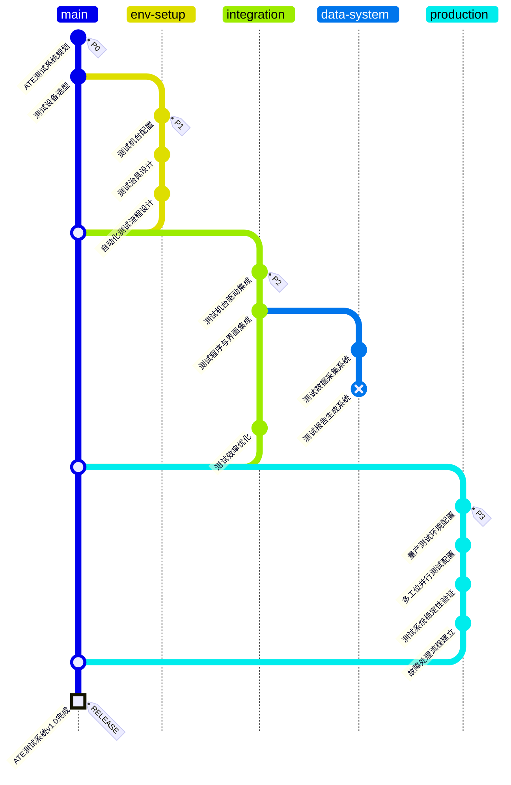

# 分支3：ATE测试环境与系统集成

```mermaid
gitGraph TB:
    commit id: "ATE测试系统规划" tag: "P0"
    commit id: "测试设备选型"
    branch env-setup
    checkout env-setup
    commit id: "测试机台配置" tag: "P1"
    commit id: "测试治具设计"
    commit id: "自动化测试流程设计"
    checkout main
    merge env-setup
    branch integration
    checkout integration
    commit id: "测试机台驱动集成" tag: "P2"
    commit id: "测试程序与界面集成"
    branch data-system
    checkout data-system
    commit id: "测试数据采集系统"
    commit id: "测试报告生成系统" type: REVERSE
    checkout integration
    commit id: "测试效率优化"
    checkout main
    merge integration
    branch production
    checkout production
    commit id: "量产测试环境配置" tag: "P3"
    commit id: "多工位并行测试配置"
    commit id: "测试系统稳定性验证"
    commit id: "故障处理流程建立"
    checkout main
    merge production
    commit id: "ATE测试系统v1.0完成" type: HIGHLIGHT tag: "RELEASE"
```

## 任务状态

- [x] P0: ATE系统规划与设备选型
- [x] P1: 测试环境搭建阶段完成
- [x] P2: 系统集成实现（报告生成系统未完成）
- [x] P3: 量产环境配置完成 