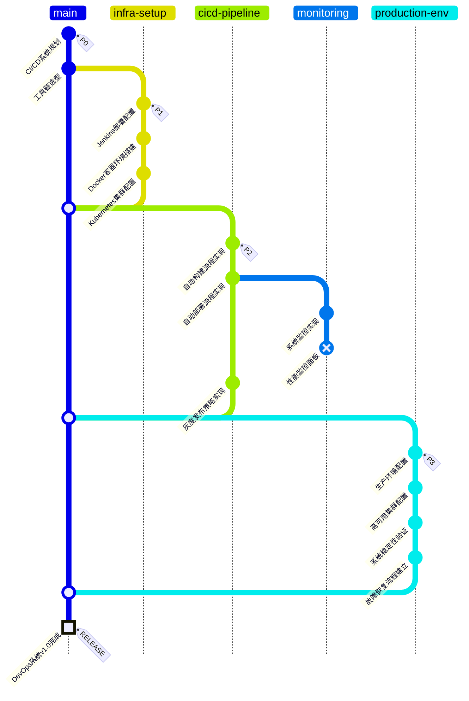

# DevOps流水线

## 任务状态

- [x] P0: CI/CD系统规划与工具选型
- [x] P1: 基础设施搭建完成
- [x] P2: 流水线实现（性能监控面板未完成）
- [x] P3: 生产环境配置完成

## 系统组件

| 组件 | 工具 | 状态 |
|-----|------|------|
| 代码仓库 | GitLab | 已配置 |
| 构建系统 | Jenkins | 已配置 |
| 容器化 | Docker | 已配置 |
| 编排系统 | Kubernetes | 已配置 |
| 监控系统 | Prometheus + Grafana | 部分完成 |
| 日志系统 | ELK Stack | 已配置 |

## 当前挑战

- 需要完成性能监控面板配置
- 优化构建速度
- 提高测试环境与生产环境一致性 