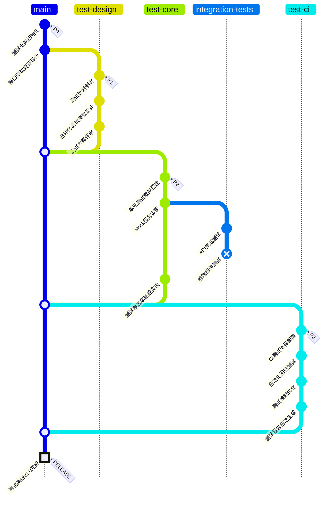

# 测试功能开发分支

## 测试任务状态

- [x] P0: 测试框架与规范设计
- [x] P1: 测试计划与流程设计完成
- [x] P2: 核心测试功能实现（前端组件测试未完成）
- [x] P3: CI测试集成完成

## 测试覆盖率

| 模块 | 行覆盖率 | 分支覆盖率 | 函数覆盖率 |
|------|---------|-----------|-----------|
| 后端API | 87% | 82% | 91% |
| 数据处理 | 92% | 88% | 94% |
| 用户界面 | 78% | 71% | 85% |
| 业务逻辑 | 81% | 76% | 88% |

## 下一步计划

- 完成前端组件测试
- 提高UI测试覆盖率
- 实现端到端测试自动化 