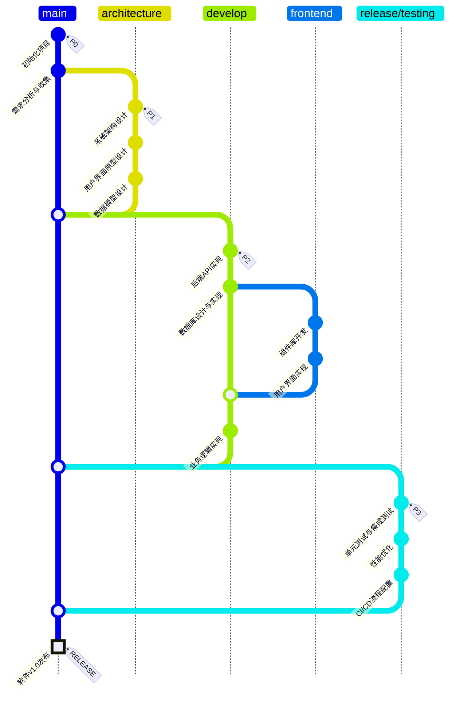

## 项目进度

- [x] P0: 项目初始化与需求分析
- [x] P1: 架构设计阶段完成
- [x] P2: 核心功能开发完成
- [x] P3: 测试与部署阶段完成
- [x] RELEASE: 产品正式发布

## 当前状态

项目主分支已完成所有开发任务，产品v1.0已成功发布并上线。主要功能包括：

- 用户管理系统
- 数据可视化面板
- 实时数据处理
- 报表生成
- 多端同步 