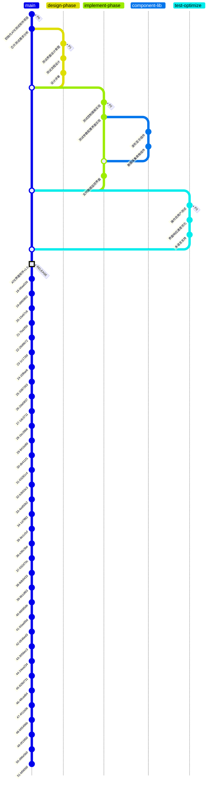

# Branch1

```mermaid
gitGraph TB:
    commit id: "初始化ATE测试软件项目" tag: "P0"
    commit id: "芯片测试需求分析"
    branch design-phase
    checkout design-phase
    commit id: "测试界面设计草图" tag: "P1"
    commit id: "测试流程设计"
    commit id: "设计评审"
    checkout main
    merge design-phase
    branch implement-phase
    checkout implement-phase
    commit id: "测试控制面板实现" tag: "P2"
    commit id: "测试参数配置界面实现"
    branch component-lib
    checkout component-lib
    commit id: "波形显示组件"
    commit id: "数据采集表格组件"
    checkout implement-phase
    merge component-lib
    commit id: "实时数据监控界面"
    checkout main
    merge implement-phase
    branch test-optimize
    checkout test-optimize
    commit id: "操作员用户测试" tag: "P3" 
    commit id: "界面响应速度优化"
    commit id: "多语言支持"
    checkout main
    merge test-optimize
    commit id: "ATE界面软件v1.0" type: HIGHLIGHT tag: "RELEASE"
    commit
    commit
    commit
    commit
    commit
    commit
    commit
    commit
    commit
    commit
    commit
    commit
    commit
    commit
    commit
    commit
    commit
    commit
    commit
    commit
    commit
    commit
    commit
    commit
    commit
    commit
    commit
    commit
    commit
    commit
    commit
    commit
    commit
    commit
```
## 任务状态

- [x] P0: 项目初始化与芯片测试需求分析
- [x] P1: 测试界面设计阶段完成
- [x] P2: 测试软件界面实现阶段完成
- [x] P3: 测试与优化阶段完成 
